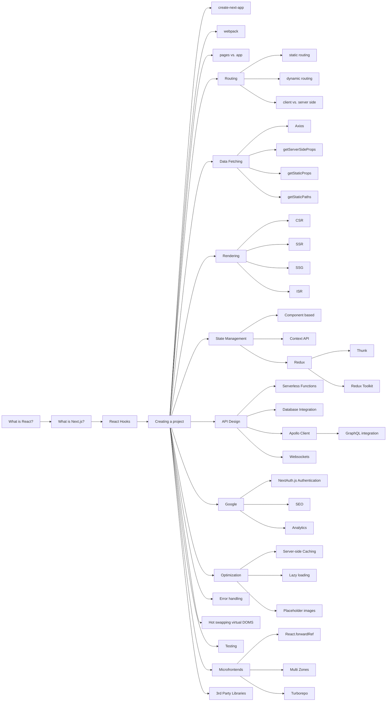

```mermaid
flowchart LR
    A[What is React?] --> B[What is Next.js?]
    B --> C[React Hooks]
    C --> D[Creating a project]
    
    D --> E[create-next-app]
    D --> F[webpack]
    D --> G[pages vs. app]

    D --> H[Routing]
    H --> H1[static routing]
    H --> H2[dynamic routing]
    H --> H3[client vs. server side]
    
    D --> I[Data Fetching]
    I --> I1[Axios]
    I --> I2[getServerSideProps]
    I --> I3[getStaticProps]
    I --> I4[getStaticPaths]

    D --> J[Rendering]
    J --> J1[CSR]
    J --> J2[SSR]
    J --> J3[SSG]
    J --> J4[ISR]

    D --> K[State Management]
    K --> K1[Component based]
    K --> K2[Context API]
    K --> K3[Redux]
    K3 --> K31[Thunk]
    K3 --> K32[Redux Toolkit]

    D --> L[API Design]
    L --> L1[Serverless Functions]
    L --> L2[Database Integration]
    L --> L3[Apollo Client]
    L3 --> L31[GraphQL integration]
    L --> L4[Websockets]

    D --> M[Google]
    M --> M1[NextAuth.js Authentication]
    M --> M2[SEO]
    M --> M3[Analytics]

    D --> N[Optimization]
    N --> N1[Server-side Caching]
    N --> N2[Lazy loading]
    N --> N3[Placeholder images]

    D --> O[Error handling]
    D --> P[Hot swapping virtual DOMS]
    D --> Q[Testing]

    D --> R[Microfrontends]
    R --> R1[React.forwardRef]
    R --> R2[Multi Zones]
    R --> R3[Turborepo]

    D --> S[3rd Party Libraries]
```
