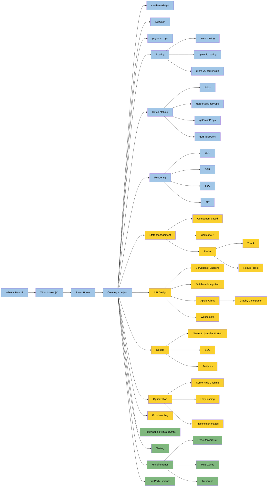

```mermaid
flowchart LR
    A["<span style='color:black;'>What is React?</span>"] --> B["<span style='color:black;'>What is Next.js?</span>"]
    B --> C["<span style='color:black;'>React Hooks</span>"]
    C --> D["<span style='color:black;'>Creating a project</span>"]
    
    D --> E["<span style='color:black;'>create-next-app</span>"]
    D --> F["<span style='color:black;'>webpack</span>"]
    D --> G["<span style='color:black;'>pages vs. app</span>"]

    D --> H["<span style='color:black;'>Routing</span>"]
    H --> H1["<span style='color:black;'>static routing</span>"]
    H --> H2["<span style='color:black;'>dynamic routing</span>"]
    H --> H3["<span style='color:black;'>client vs. server side</span>"]
    
    D --> I["<span style='color:black;'>Data Fetching</span>"]
    I --> I1["<span style='color:black;'>Axios</span>"]
    I --> I2["<span style='color:black;'>getServerSideProps</span>"]
    I --> I3["<span style='color:black;'>getStaticProps</span>"]
    I --> I4["<span style='color:black;'>getStaticPaths</span>"]

    D --> J["<span style='color:black;'>Rendering</span>"]
    J --> J1["<span style='color:black;'>CSR</span>"]
    J --> J2["<span style='color:black;'>SSR</span>"]
    J --> J3["<span style='color:black;'>SSG</span>"]
    J --> J4["<span style='color:black;'>ISR</span>"]

    D --> K["<span style='color:black;'>State Management</span>"]
    K --> K1["<span style='color:black;'>Component based</span>"]
    K --> K2["<span style='color:black;'>Context API</span>"]
    K --> K3["<span style='color:black;'>Redux</span>"]
    K3 --> K31["<span style='color:black;'>Thunk</span>"]
    K3 --> K32["<span style='color:black;'>Redux Toolkit</span>"]

    D --> L["<span style='color:black;'>API Design</span>"]
    L --> L1["<span style='color:black;'>Serverless Functions</span>"]
    L --> L2["<span style='color:black;'>Database Integration</span>"]
    L --> L3["<span style='color:black;'>Apollo Client</span>"]
    L3 --> L31["<span style='color:black;'>GraphQL integration</span>"]
    L --> L4["<span style='color:black;'>Websockets</span>"]

    D --> M["<span style='color:black;'>Google</span>"]
    M --> M1["<span style='color:black;'>NextAuth.js Authentication</span>"]
    M --> M2["<span style='color:black;'>SEO</span>"]
    M --> M3["<span style='color:black;'>Analytics</span>"]

    D --> N["<span style='color:black;'>Optimization</span>"]
    N --> N1["<span style='color:black;'>Server-side Caching</span>"]
    N --> N2["<span style='color:black;'>Lazy loading</span>"]
    N --> N3["<span style='color:black;'>Placeholder images</span>"]

    D --> O["<span style='color:black;'>Error handling</span>"]
    D --> P["<span style='color:black;'>Hot swapping virtual DOMS</span>"]
    D --> Q["<span style='color:black;'>Testing</span>"]

    D --> R["<span style='color:black;'>Microfrontends</span>"]
    R --> R1["<span style='color:black;'>React.forwardRef</span>"]
    R --> R2["<span style='color:black;'>Multi Zones</span>"]
    R --> R3["<span style='color:black;'>Turborepo</span>"]

    D --> S["<span style='color:black;'>3rd Party Libraries</span>"]

    %% Day Color Styles
    style A fill:#A1C6E7
    style B fill:#A1C6E7
    style C fill:#A1C6E7
    style D fill:#A1C6E7
    style E fill:#A1C6E7
    style F fill:#A1C6E7
    style G fill:#A1C6E7
    style H fill:#A1C6E7
    style H1 fill:#A1C6E7
    style H2 fill:#A1C6E7
    style H3 fill:#A1C6E7
    style I fill:#A1C6E7
    style I1 fill:#A1C6E7
    style I2 fill:#A1C6E7
    style I3 fill:#A1C6E7
    style I4 fill:#A1C6E7
    style J fill:#A1C6E7
    style J1 fill:#A1C6E7
    style J2 fill:#A1C6E7
    style J3 fill:#A1C6E7
    style J4 fill:#A1C6E7

    style K fill:#FAD02E
    style K1 fill:#FAD02E
    style K2 fill:#FAD02E
    style K3 fill:#FAD02E
    style K31 fill:#FAD02E
    style K32 fill:#FAD02E
    style L fill:#FAD02E
    style L1 fill:#FAD02E
    style L2 fill:#FAD02E
    style L3 fill:#FAD02E
    style L31 fill:#FAD02E
    style L4 fill:#FAD02E
    style M fill:#FAD02E
    style M1 fill:#FAD02E
    style M2 fill:#FAD02E
    style M3 fill:#FAD02E
    style N fill:#FAD02E
    style N1 fill:#FAD02E
    style N2 fill:#FAD02E
    style N3 fill:#FAD02E
    style O fill:#FAD02E

    style P fill:#7FB77E
    style Q fill:#7FB77E
    style R fill:#7FB77E
    style R1 fill:#7FB77E
    style R2 fill:#7FB77E
    style R3 fill:#7FB77E
    style S fill:#7FB77E
```
